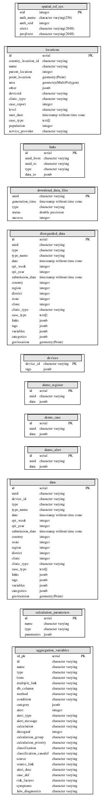

============================
Database structure
============================
The database structure used by meerkat abacus and meerkat api can be seen in the image below. For each country implementation the demo_case, demo_register and demo_alerts tables will be replaced by respective tables based on the forms in use. We have one table per form.

The database structure is based on utilising PostgreSQL JSON format. This allows to take advantage of the flexibility of JSON storgage and normal relational strcutures. 

